# C语言课设 - 学生综合测评管理系统

## 前言

大一下时写的课设，当时写的还是很用心的（虽然现在回头看多少还挺屎山的2333，不过可以当作一个思路参考~），如今重新把文档以md方式改造了下，希望能造福学弟学妹们~

## 需求分析

* 第一次进入系统时提示管理员注册，再次进入时显示登录/注册界面
* 只能注册普通用户，可由管理员提升权限，登录后可识别管理员/普通用户权限
* 学生基本信息包括：班级、学号、姓名、三门课程（高等数学、大学英语和C语言）的成绩、考试平均成绩、考试名次、同学互评分、辅导员评分、班主任老师评分、综合测评总分、综合测评名次。考试平均成绩、同学互评分、辅导员评分、班主任老师评分分别占综合测评总分的70%、10%、10%、10%。提示：综合测评总分＝考试平均成绩*0.7+同学互评分*0.1+辅导员评分*0.1+班主任老师评分*0.1。
* 管理员可提升普通用户权限
* 能够输入学生基本信息，要求学号唯一，并按学号升序存入文件中。（需管理员权限）
* 能够进行查找并显示相关信息——可按学号、姓名、班级进行查找，或进行模糊查找，按学号或姓名进行模糊查找。
* 能够插入、删除、修改学生信息，并将修改后的信息再次写入文件。（需管理员权限）
* 能够报表打印，导出为AllStudent文件或AllUsers文件，以csv格式存储，可直接在excel表格中打开。

## 概要设计

### 数据结构

主要数据为Student类和User类的对象，用STL中的动态数组vector进行存储，迭代器遍历取出，同时用algorithm中的sort函数对其进行排序，在文件中以二进制形式存储，节省空间且安全。下面为各类介绍。

#### User类

 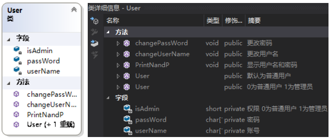

数据成员为单个用户信息(账号、密码、权限)，以及改密码、改用户名等方法，同时将登陆注册等函数设置为友元函数方便访问。

#### Student类

 

数据成员为单个学生信息(详情如图)，以及修改信息的不同方法、展示信息的两种方法，同时重载了小于号排序规则，可按学号升序排序，将操作类设置为友元类方便访问。

#### Menus类

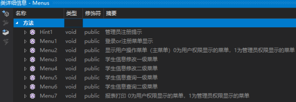

显示不同菜单，方法为不同菜单/提示的显示。

#### Operate类

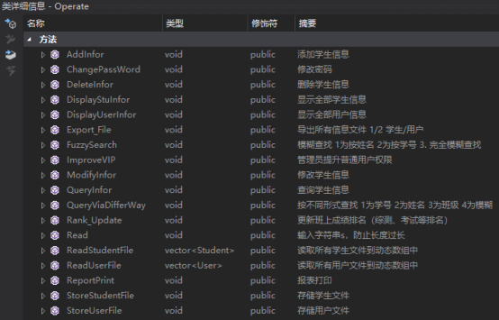

操作类，存储从主界面进入后可调用的所有操作函数

### 模块划分

主要模块有以下几个：

1. 登录注册模块：第一次进入系统时提醒注册管理员账号密码，建立User文件，之后进入的时候就只能注册为普通用户，注册时输入的用户名或密码过长都会提示，同时会检测该用户是否已被注册。登录时检查用户名和密码是否正确，不正确则返回主界面。
2. 学生与用户文件读写、存取、更新模块
3. 学生信息的添加模块：输入学生学号可添加学生信息，若学号已存在则重新输入。
4. 学生信息的删除模块：输入学生学号可删除学生信息，若学号已存在则重新输入，删除前询问是否确认删除。
5. 学生信息的修改模块：输入学生学号对学生信息进行修改。
6. 学生信息的查找模块：通过不同方式实现学生信息的查找，姓名、学号、班级、模糊查找。
7. 用户信息的更改模块：更改密码、更改权限。
8. 所有信息报表打印模块：可导出为csv文件用Excel表格打开打印。

### 总体框架

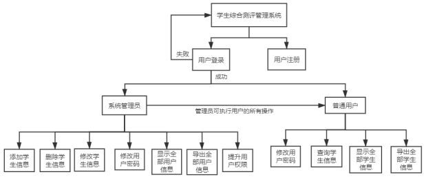

## 详细设计

### 文件存储函数

**函数原型：**

```cpp
void StoreStudentFile(vector<Student> ss);//存储学生文件
void StoreUserFile(vector<User> uu);//存储用户文件
```

**函数功能描述：**

形参为存储着所有学生/用户信息的动态数组，用对应类型的迭代器取出每个对象，将其以二进制方式存储到文件中，而不是以文本形式，这样可以避免由于换行符等在不同操作系统下表现不同引起的读取文件时的错误。用c++中的文件流fstream实现，需要fstream头文件

**函数详情：**

```cpp
void Operate::StoreStudentFile(vector<Student> ss) {
	Student s;
	fstream of;
	of.open(StudentFile, ios::out | ios::binary);
	vector<Student>::iterator it;
	for (it = ss.begin(); it != ss.end(); it++) {
		s = *it;
		of.write((char*)&s, sizeof(s));	 //存入文件
	}
	of.close();
}
void Operate::StoreUserFile(vector<User> uu) {
	User u;
	fstream of;
	of.open(UserFileName, ios::out | ios::binary);
	vector<User>::iterator it;
	for (it = uu.begin(); it != uu.end(); it++) {
		u = *it;
		of.write((char*)&u, sizeof(u));	 //存入文件
	}
	of.close();
}
```

### 文件读取函数

**函数原型：**

```cpp
vector<Student> ReadStudentFile();//读取所有学生文件到动态数组中
vector<User> ReadUserFile();//读取所有用户文件到动态数组中
```

**函数功能描述：**

返回值为存储着所有学生/用户信息的动态数组，以二进制形式读取出来存入该动态数组。

**函数详情：**

```cpp
vector<Student> Operate::ReadStudentFile() {
	Student s;
	fstream fp;
	vector<Student> ss;
	fp.open(StudentFile, ios::in | ios::binary);
	while (fp.read((char*)&s, sizeof(s))) {	 //读出之前所有学生信息
		ss.push_back(s);
	}
	fp.close();
	return ss;
}
vector<User> Operate::ReadUserFile() {
	User u;
	fstream fp;
	vector<User> uu;
	fp.open(UserFileName, ios::in | ios::binary);
	while (fp.read((char*)&u, sizeof(u))) {	 //读出之前所有学生信息
		uu.push_back(u);
	}
	fp.close();
	return uu;
}
```

### 初始化、登陆注册函数

**函数原型：**

```cpp
void Init();			//初始化 调整控制台窗口大小及颜色 显示登录or注册菜单
bool Login();		 //登陆操作
void Register(int i = 0);//注册操作，// 0为普通用户注册，1为管理员注册
void LandR();//登录注册主菜单
```

**函数功能描述：**

初始化函数先设置好控制台窗口的大小及颜色，再检测是否有用户，若当前还没有任何用户则提示进行管理员注册，否则进入登录注册主菜单。

登陆函数返回登录成功与否，若登录成功则全局对象U为当前用户。

注册函数则进行注册并存入User.txt文件。

登录注册主菜单函数通过登录函数的返回值判断登录是否成功，成功了或按了ESC直接返回，否则继续循环。

注册操作考虑到了账号重复、输入过长等异常情况。

**函数详情：**

```cpp
bool Login() {
	system("cls");
	vector<User> uu = O.ReadUserFile();
	vector<User>::iterator it;
	char un[15], pw[15];
	cout << "\n\t\t\t ╭═══════════════════════════════════○●○●═══╮" << endl;
	cout << "\t\t\t│    学生综合测评管理系统————登录界面        │" << endl;
	cout << "\t\t\t╰ ═══○●○●═══════════════════════════════════ ╯\n\n" << endl;
	cout << "\t\t\t\t 请输入账号（最长14位）:";
	O.Read(un);
	cout << "\t\t\t\t 请输入密码（最长14位）:";
	O.Read(pw);
	getchar();
	cout << endl;
	for (it = uu.begin(); it != uu.end(); it++) {
		U = *it;
		if (strcmp(un, U.userName) == 0 && strcmp(pw, U.passWord) == 0) {
			return true;
		}
	}
	return false;
}
void Register(int i) {	// 0为普通用户注册，1为管理员注册
	char un[15], pw[15];
	vector<User> uu = O.ReadUserFile();
	vector<User>::iterator it;
	if (i == 0) {  //普通用户注册
		system("cls");
		cout << "\n\t\t\t ╭═══════════════════════════════════○●○●═══╮" << endl;
		cout << "\t\t\t│    学生综合测评管理系统————注册界面        │" << endl;
		cout << "\t\t\t╰ ═══○●○●═══════════════════════════════════ ╯\n"
			 << endl;
		User U1(0);
		cout << "\t\t\t\t 请输入账号（最长14位）:";
		O.Read(un);
		bool flag = true;//账号是否重复
		while (flag) {
			bool k = false;
			for (it = uu.begin(); it != uu.end(); it++) {
				U = *it;
				if (strcmp(un, U.userName) == 0) {
					flag = true;
					cout << "\t\t\t 账号已存在,请重新输入账号（最长14位）:";
					O.Read(un);
					k = true;
					break;
				}
			}
			if (!k)//如果是结束循环出来的，说明账号不再重复了
				flag = false;
		}
		U1.changeUserName(un);
		cout << "\t\t\t\t 请输入密码（最长14位）:";
		O.Read(pw);
		U1.changePassWord(pw);
		printf("\t\t\t\t 您的账号为:%s\n\n", un);
		printf("\t\t\t\t 您的密码为:%s\n\n", pw);
		uu.push_back(U1);
	}  else {	//管理员注册
		User M(1);
		cout << "\t\t\t\t 输入管理员账号（最长14位）:";
		O.Read(un);
		M.changeUserName(un);
		cout << "\t\t\t\t 输入管理员密码（最长14位）:";
		O.Read(pw);
		M.changePassWord(pw);
		printf("\t\t\t\t 管理员账号为:%s\n\n", un);
		printf("\t\t\t\t 管理员密码为:%s\n\n", pw);
		uu.push_back(M);
	}
	O.StoreUserFile(uu);
	cout << "\t\t\t\t注册完毕！按任意键返回上一步" << endl;
	_getch();
}
void LandR() {
	while (1) {
		menus.Menu1();	//显示登录or注册菜单
		bool flag = false;	//登录成功与否
		int c = _getch();
		if (c == 49) {	 //为1 则执行登录操作
			flag = Login();
			if (flag) {
				cout << "\t\t\t\t\t登录成功！" << endl;
				Sleep(500);
				system("cls");
				return;
			} else {//登陆失败
				cout << "\t\t\t\t登录失败,用户名或密码有误！" << endl;
				Sleep(500);
				menus.Menu1();	//显示登录or注册菜单
			}
		} else if(c == 50){ //为2 则执行注册操作
			Register();	 //普通用户注册
			menus.Menu1();
		} else if (c == 27) {//ESC退出
			exit(0);
		}
	}
}
void Init() {							  //初始化 显示登录or注册菜单
	system("mode con cols=96 lines=35");  //改变宽高
	system("color F0"); 			//改变控制台窗口颜色
	vector<User> uu = O.ReadUserFile();
	if (uu.empty()) {
		menus.Hint1();	//管理员注册提示
		Register(1);
	}
	LandR();
}
```

### 主菜单

**函数原型：**

void MainInterface();

**函数功能描述：**

通过conio.h这个头文件中的_getch()函数可**不回显地**获取键值，若为ESC键，则_getch函数会返回27，后面程序也大多使用这种方式获取输入。通过全局的用户类对象U，判断权限，再通过全局对象O调用操作类函数进行主要操作。

**函数详情：**

```cpp
void MainInterface() {
	while (1) {
		menus.Menu2(U.isAdmin);
		if (U.isAdmin) {//管理员
			switch (_getch()) {
				case '1': O.AddInfor(U); break;	// 1. 添加学生信息
				case '2': O.DeleteInfor(U); break;  // 2. 删除学生信息
				case '3': O.ModifyInfor(U); break;  // 3. 修改学生信息
				case '4': O.QueryInfor(U); break;	  // 4. 查询学生信息
				case '5': O.DisplayStuInfor(U); break;	// 5. 显示全部学生信息
				case '6': O.DisplayUserInfor(U); break;	 // 6. 显示全部用户信息
				case '7': O.ReportPrint(U); break;	 // 7. 导出全部信息
				case '8': O.ChangePassWord(U); break;	 // 8. 修改用户密码
				case '9': O.ImproveVIP(U); break;  // 9. 提升普通用户权限
				case 27: Init(); break;	 // ESC，回到上个界面
				default: break;
			}
		} else {//普通用户
			switch (_getch()) {
				case '1': O.ChangePassWord(U); break;	 // 1. 修改用户密码
				case '2': O.QueryInfor(U); break;		 // 2. 查询学生信息
				case '3': O.DisplayStuInfor(U); break;	// 3. 显示全部学生信息
				case '4': O.ReportPrint(U); break;	 // 4. 导出全部信息
				case 27: Init(); break; // ESC，回到上个界面
				default: break;
			}
		}
	}
}
```

### 添加学生信息功能

**函数原型：**

```cpp
void AddInfor(User& U);		 //添加学生信息
void Rank_Update();//更新班上成绩排名（综测、考试等排名）
```

**函数功能描述：**

通过ReadStudentFile函数将所有学生信息读入动态数组ss中，进行新的学生信息添加，然后在Rank_Update函数中更新班级排名并重新存入文件中

**函数详情：**

```cpp
void Operate::AddInfor(User& U) {
	Student s1, s;
	system("cls");
	cout << "\n\t\t\t ╭═══════════════════════════════════○●○●═══╮" << endl;
	cout << "\t\t\t│     学生综合测评管理系统——学生信息添加界面   │" << endl;
	cout << "\t\t\t╰ ═══○●○●═══════════════════════════════════ ╯\n" << endl;
	char stunum[15];
	cout << "\t\t\t   请输入要添加的学生的学号：";
	Read(stunum);
	vector<Student> ss = ReadStudentFile();
	vector<Student>::iterator it;
	//确保文件中之前没有这个学生的信息（学号唯一）
	bool flag = true;  //是否需要再检测一轮
	while (flag) {
		bool k = false;	 //是否有重复
		for (it = ss.begin(); it != ss.end(); it++) {
			s = *it;
			if (strcmp(stunum, s.stuNum) == 0) {  //学号有重复的
				flag = true;
				cout << "\t\t\t该学生信息已存在,请重新输入要添加的学生的学号:";
				Read(stunum);
				k = true;
				break;
			}
		}
		if (!k)	 //如果是结束循环出来的，说明学号不再重复了
			flag = false;
	}
	s1.InputInfor();  //输入信息
	ss.push_back(s1);
	StoreStudentFile(ss);
	Rank_Update();  //更新排名
	cout << "\t\t\t\t---添加完毕！按任意键返回上一步---" << endl;
	_getch();
}
void Operate::Rank_Update() {
	vector<Student> ss = ReadStudentFile();
	vector<Student> news;
	set<string> classes;
	vector<Student> vv;
	vector<Student>::iterator it;
	set<string>::iterator st;
	for (it = ss.begin(); it != ss.end(); it++) {
		string str = (*it).Class;
		classes.insert(str);
	}
	for (st = classes.begin(); st != classes.end(); st++) {//每个班级
		int averank = 1;
		int mulrank = 1;
		vv.clear();
		for (it = ss.begin(); it != ss.end(); it++) {//将该班级所有同学放入vv中
			if (strcmp((*st).c_str(), (*it).Class) == 0 ) {  //同班同学
				vv.push_back(*it);
			}
		}
		sort(vv.begin(), vv.end(), cmp_exam);//按考试成绩排序
		for (it = vv.begin(); it != vv.end(); it++) {
			(*it).examRank = averank;
			averank++;
		}
		sort(vv.begin(), vv.end(), cmp_multi);	//按综测排序
		for (it = vv.begin(); it != vv.end(); it++) {
			(*it).multiGradeRank = mulrank;
			news.push_back(*it);
			mulrank++;
		}

	}
	sort(news.begin(), news.end());
	StoreStudentFile(news);
}
```

### 删除学生信息功能

**函数原型：**

```cpp
void DeleteInfor(User& U);	 //删除学生信息
```

**函数功能描述：**

通过ReadStudentFile函数将所有学生信息读入动态数组ss中，在ss中找到指定的学生信息后删除，通过StoreStudentFile函数重新存储到Student文件中。

**函数详情：**

```cpp
void Operate::DeleteInfor(User& U) {
	Student s;
	vector<Student> ss = ReadStudentFile();
	vector<Student>::iterator it;
	char stunum[15];
	system("cls");
	cout << "\n\t\t\t ╭═══════════════════════════════════○●○●═══╮" << endl;
	cout << "\t\t\t│     学生综合测评管理系统——学生信息删除界面   │" << endl;
	cout << "\t\t\t╰ ═══○●○●═══════════════════════════════════ ╯\n" << endl;
	cout << "\t\t\t   请输入要删除的学生的学号：";
	bool flag = true;
	while (flag) {
		Read(stunum);
		for (it = ss.begin(); it != ss.end(); it++) {
			s = (*it);
			if (strcmp(stunum, s.stuNum) == 0) {
				flag = false;  //找到了要删除的学生
				cout << "\t\t\t\t要删除的学生的信息如下\n" << endl;
				cout << "-----学号------姓名------班级------高数----大英----"
						"c语言--平均成绩--综测总分--成绩排名--综测排名\n"
					 << endl;
				s.display();
				cout << "\n\t\t\t---确认要删除吗？按ESC取消删除,按回车确定删除-"
						"--"
					 << endl;
				int c = _getch();
				if (c == 27) {	// ESC
					break;
				}
				else {
					it = ss.erase(it);
					cout << "\n\t\t\t\t删除完成！\n" << endl;
					Sleep(500);
					break;
				}
			}
		}
		if (flag) {	 //未找到
			cout << "\t\t\t\t未找到该学生,请重新输入学号：";
		}
	}
	//删除完毕，重新存入文件
	StoreStudentFile(ss);
	Rank_Update();
}
```

### 修改学生信息功能

**函数原型：**

```cpp
void ModifyInfor(User& U);	 //修改学生信息
```

**函数功能描述：**

通过ReadStudentFile函数将所有学生信息读入动态数组ss中，在ss中找到指定的学生信息后进行修改，通过StoreStudentFile函数重新存储到Student文件中。

**函数详情：**

```cpp
void Operate::ModifyInfor(User& U) {
	system("cls");
	cout << "\n\t\t\t ╭═══════════════════════════════════○●○●═══╮" << endl;
	cout << "\t\t\t│     学生综合测评管理系统——学生信息修改界面   │" << endl;
	cout << "\t\t\t╰ ═══○●○●═══════════════════════════════════ ╯\n" << endl;
	cout << "\t\t\t   请输入要修改学生的学号:";
	vector<Student> ss = ReadStudentFile();
	vector<Student>::iterator it;
	char stunum[15];
	bool flag = true;
	while (flag) {
		Read(stunum);
		for (it = ss.begin(); it != ss.end(); it++) {
			if (strcmp(stunum, (*it).stuNum) == 0) {
				flag = false;  //找到了要修改的学生
				cout << "\t\t\t   要修改的学生的信息如下\n" << endl;
				cout << "-----学号------姓名------班级------高数----大英----"
						"c语言--平均成绩--综测总分--成绩排名--综测排名\n"
					 << endl;
				(*it).display();
				cout << endl;
				cout << "\t\t\t---"
						"确认要修改吗？按ESC可退出，按其他任意键可进入下一步---"
					 << endl;
				int c = _getch();
				if (c == 27) {	// ESC
					break;
				}
				else {	//回车
					(*it).Change();
					Sleep(500);
					break;
				}
			}
		}
		if (flag) {	 //未找到
			cout << "\t\t\t\t未找到该学生,请重新输入学号：";
		}
	}
	StoreStudentFile(ss);
	Rank_Update();
}
```

### 查询学生信息功能

**函数原型：**

```cpp
void QueryInfor(User& U);	 //查询学生信息
void QueryViaDifferWay(int i); //按不同形式查找1为学号2为姓名3为班级4为模糊
void FuzzySearch(int i);//模糊查找 1为按姓名 2为按学号 3. 完全模糊查找
```

**函数功能描述：**

在QueryInfor函数中选择查询方式并进入，QueryViaDifferWay函数中通过形参决定查询方式，模糊查找则进一步进入FuzzySearch函数，通过strstr函数实现模糊查找(搜索一个字符串在另一个字符串的子串中是否出现过)，

**函数详情：**

```cpp
void Operate::QueryInfor(User& U) {
	system("cls");
	bool flag = true;
	while (flag) {
		menus.Menu5();
		switch (_getch()) {
			case '1': QueryViaDifferWay(1); break;	// 1. 按学号查询单个学生信息
			case '2': QueryViaDifferWay(2); break;	// 2. 按姓名查询学生信息
			case '3': QueryViaDifferWay(3); break;	// 3. 按班级查询学生信息
			case '4': QueryViaDifferWay(4); break;	// 4. 模糊查找
			case 27: flag = false; break;			// ESC，回到上个界面
			default: break;
		}
	}
}
void Operate::QueryViaDifferWay(int i) {
	Student s;
	vector<Student> ss = ReadStudentFile();
	vector<Student>::iterator it;
	system("cls");
	cout << "\n\t\t\t ╭═══════════════════════════════════○●○●═══╮" << endl;
	cout << "\t\t\t│     学生综合测评管理系统——学生信息查询界面   │" << endl;
	cout << "\t\t\t╰ ═══○●○●═══════════════════════════════════ ╯\n" << endl;
	if (i == 1) {  //学号查找
		cout << "\t\t\t   请输入学号：";
		char stunum[15];
		bool flag = true;
		while (flag) {
			Read(stunum);
			for (it = ss.begin(); it != ss.end(); it++) {
				if (strcmp(stunum, (*it).stuNum) == 0) {
					flag = false;  //找到了
					cout << "\t\t\t该学生的详细信息如下\n" << endl;
					(*it).PrintDetail();
					cout << "\t\t\t\t\t---按ESC可退出---" << endl;
					while (1) {
						int c = _getch();
						if (c == 27)  // ESC
							break;
					}
					break;
				}
			}
			if (flag) {	 //未找到
				cout << "\t\t\t\t未找到该学生,请重新输入学号：";
			}
		}
	}
	else if (i == 2) {
		cout << "\t\t\t   请输入姓名：";
		char name[15];
		bool flag = true;
		while (flag) {
			Read(name);
			for (it = ss.begin(); it != ss.end(); it++) {
				if (strcmp(name, (*it).name) == 0) {
					flag = false;  //找到了该学生
					cout << "\t\t\t该学生的详细信息如下\n" << endl;
					(*it).PrintDetail();
				}
			}
			if (flag) {	 //未找到
				cout << "\t\t\t\t未找到该学生,请重新输入姓名：";
			}
			else {
				cout << "\t\t\t\t\t---按ESC可退出---" << endl;
				while (1) {
					int c = _getch();
					if (c == 27)  // ESC
						break;
				}
			}
		}
	}
	else if (i == 3) {
		cout << "\t\t\t   请输入要查询的班级：";
		char cl[15];
		bool flag = true;
		vector<Student> s1;
		Student s;
		while (flag) {
			Read(cl);
			for (it = ss.begin(); it != ss.end(); it++) {
				if (strcmp(cl, (*it).Class) == 0) {
					s = *it;
					s1.push_back(s);
					flag = false;  //找到了该班级学生
				}
			}
			if (flag) {	 //未找到
				cout << "\t\t\t\t未找到该班级学生,请重新输入班级：";
			}
			else {
				cout << "--------------------------------------该班级共有";
				printf_s("  %-3d", s1.size());
				cout << "名学生-------------------------------------\n" << endl;
				cout << "----学号------姓名------班级------高数----大英----"
						"c语言--平均成绩--综测总分--成绩排名---综测排名\n"
					 << endl;
				for (it = s1.begin(); it != s1.end(); it++) {
					(*it).display();
					cout << endl;
				}
				cout << "\t\t\t\t\t---按ESC可退出---" << endl;
				while (1) {
					int c = _getch();
					if (c == 27)  // ESC
						break;
				}
			}
		}
	}
	else if (i == 4) {
		bool flag = true;
		while (flag) {
			m.Menu6();
			switch (_getch()) {
				case '1': FuzzySearch(1); break;  // 1. 按姓名模糊查找
				case '2': FuzzySearch(2); break;  // 2. 按学号模糊查找
				case '3': FuzzySearch(3); break;  // 3. 完全模糊查找
				case 27: flag = false; break;	  // ESC，回到上个界面
				default: break;
			}
		}
	}
}
void Operate::FuzzySearch(int i) {
	system("cls");
	cout << "\n\t\t\t ╭═══════════════════════════════════○●○●═══╮" << endl;
	cout << "\t\t\t│     学生综合测评管理系统——学生信息查询界面   │" << endl;
	cout << "\t\t\t╰ ═══○●○●═══════════════════════════════════ ╯\n" << endl;
	char str[15];
	Student s;
	vector<Student> ss = ReadStudentFile();
	vector<Student> s1, s2;
	vector<Student>::iterator it;
	cout << "\t\t\t   请输入一串字符:";
	bool flag = true;
	while (flag) {
		s1.clear();
		s2.clear();
		Read(str);
		for (it = ss.begin(); it != ss.end(); it++) {
			if (strstr((*it).name, str) && i != 2) {
				s = *it;
				flag = false;  //按姓名模糊查找到了学生
				s1.push_back(s);
			}
			if (strstr((*it).stuNum, str) && i != 1) {
				s = *it;
				flag = false;  //按学号模糊查找到了学生
				s1.push_back(s);
			}
			if ((strstr((*it).Class, str) || strstr((*it).name, str) ||
				strstr((*it).stuNum, str)) && i == 3) {
				s = *it;
				s2.push_back(s);
			}
		}
		if (flag) {	 //未找到
			cout << "\t\t模糊查找未找到匹配的学生,请重新输入一串字符：";
		}
		else {
			if (i == 3)
				s1 = s2;
			cout << "--------------------------------此次模糊查找共找到";
			printf_s("  %-3d", s1.size());
			cout << "名学生-----------------------------------\n" << endl;
			cout << "----学号------姓名------班级------高数----大英----"
					"c语言--平均成绩--综测总分--成绩排名---综测排名\n"
				 << endl;
			for (it = s1.begin(); it != s1.end(); it++) {
				(*it).display();
				cout << endl;
			}
			cout << "\t\t\t\t\t---按ESC可退出---" << endl;
			while (1) {
				int c = _getch();
				if (c == 27)  // ESC
					break;
			}
		}
	}
}
```

### 显示全部学生信息功能

**函数原型：**

```cpp
void DisplayStuInfor(User& U);	 //显示全部学生信息
```

**函数功能描述：**

通过ReadStudentFile函数将所有学生信息读入动态数组ss中，迭代器遍历实现每一个学生信息的展示。

**函数详情：**

```cpp

void Operate::DisplayStuInfor(User& U) {
	system("cls");
	cout << "\n\t\t\t ╭═══════════════════════════════════○●○●═══╮" << endl;
	cout << "\t\t\t│     学生综合测评管理系统——全部学生信息展示   │" << endl;
	cout << "\t\t\t╰ ═══○●○●═══════════════════════════════════ ╯\n\n" << endl;
	Student s;
	vector<Student> ss = ReadStudentFile();
	sort(ss.begin(), ss.end());
	if (ss.empty())
		cout << "--------------------------------------当前暂未有任"
				"何学生!-----------------------------------"
			 << endl;
	else {
		cout << "----------------------------------------当前共有";
		printf_s("  %-3d", ss.size());
		cout << "名学生-------------------------------------\n" << endl;
		cout << "-----学号------姓名------班级------高数----大英----c语言--"
				"平均成绩--综测总分--成绩排名--综测排名\n"
			 << endl;
	}
	vector<Student>::iterator it;
	for (it = ss.begin(); it != ss.end(); it++) {
		s = *it;
		s.display();
		cout << endl;
	}
	cout << "\t\t\t\t\t---按ESC可退出---" << endl;
	bool flag = true;
	while (flag) {
		switch (_getch()) {
			case 27: flag = false; break;  // ESC，回到上个界面
			default: break;
		}
	}
}
```

### 报表打印功能

**函数原型：**

```cpp
void ReportPrint(User& U);		 //报表打印

void Export_File(int i);//导出所有信息文件 1/2 学生/用户
```

**函数功能描述：**

导出时需存为csv文件，同时“,”分隔列，换行符分隔行，即可用Excel打开

**函数详情：**

```cpp


void Operate::ReportPrint(User& U) {
	bool flag = true;
	while (flag) {
		m.Menu7(U.isAdmin);
		if (U.isAdmin) {
			switch (_getch()) {
				case '1': Export_File(1); break;  // 1. 导出全部学生信息
				case '2': Export_File(2); break;  // 2. 导出全部用户信息
				case 27: flag = false; break;	  // ESC，回到上个界面
				default: break;
			}
		}
		else {
			switch (_getch()) {
				case '1': Export_File(1); break;  // 1. 导出全部学生信息
				case 27: flag = false; break;	  // ESC，回到上个界面
				default: break;
			}
		}
	}
}
void Operate::Export_File(int i) {
	fstream fp;
	if (i == 1) {
		fp.open(ExportStuFile, ios::out);
		vector<Student> ss = ReadStudentFile();
		vector<Student>::iterator it;
		if (fp) {
			fp << "学号,姓名,班级,高等数学成绩,大学英语成绩,C语言成绩,"
				  "考试平均成绩,考试名次(班级),同学互评分,辅导员评分,"
				  "班主任老师评分,"
				  "综合测评总分,综合测评名次(班级)"
			   << endl;
			for (it = ss.begin(); it != ss.end(); it++) {
				Student s = *it;
				fp << s.stuNum << "," << s.name << "," << s.Class << ",";
				for (int i = 0; i < 3; i++)
					fp << s.examGrade[i] << ",";
				fp << s.avrGrade << "," << s.examRank << ",";
				for (int i = 0; i < 3; i++)
					fp << s.givenMark[i] << ",";
				fp << s.multiGrade << "," << s.multiGradeRank << endl;
			}
			cout << "\n\t\t\t\t导出完毕！";
			Sleep(500);
		}
		else {
			cout << "文件打开失败！" << endl;
		}
	}
	else if (i == 2) {
		fp.open(ExportUserFile, ios::out);
		vector<User> uu = ReadUserFile();
		vector<User>::iterator it;
		if (fp) {
			fp << "用户名,密码,权限" << endl;
			for (it = uu.begin(); it != uu.end(); it++) {
				User u = *it;
				fp << u.userName << "," << u.passWord << ",";
				if (u.isAdmin)
					fp << "管理员" << endl;
				else
					fp << "用户" << endl;
			}
			cout << "\n\t\t\t\t导出完毕！";
			Sleep(500);
		}
		else {
			cout << "文件打开失败！" << endl;
		}
	}
	fp.close();
}
```

### 修改用户密码

**函数原型：**

```cpp
void ChangePassWord(User& U);//修改密码
```

**函数功能描述：**

通过ReadUserFile函数将所有用户信息读入动态数组uu中，在uu中找到指定的用户信息后更改，再通过StoreUserFile函数重新存储到User文件中。

**函数详情：**

```cpp
void Operate::ChangePassWord(User& U) {
	vector<User> u = ReadUserFile();
	vector<User>::iterator it;
	system("cls");
	cout << "\n\t\t\t ╭═══════════════════════════════════○●○●═══╮" << endl;
	cout << "\t\t\t│       学生综合测评管理系统——用户密码修改\t │" << endl;
	cout << "\t\t\t╰ ═══○●○●═══════════════════════════════════ ╯\n\n" << endl;
	if (U.isAdmin) {  //管理员可以更改所有用户的账号密码
		User temp;
		cout << "\t\t\t管理员可更改任意用户的密码,输入用户名即可更改其密码:";
		char un[15], pw[15];
		bool flag = true;
		while (flag) {
			Read(un);
			for (it = u.begin(); it != u.end(); it++) {
				if (strcmp(un, (*it).userName) == 0) {
					flag = false;
					cout << "\t\t\t\t 请输入新密码：";
					char pw[15];
					Read(pw);
					(*it).changePassWord(pw);
					cout << "\t\t\t\t  修改成功！" << endl;
					Sleep(500);
				}
			}
			if (flag) {
				cout << "\t\t\t\t未找到该用户,请重新输入用户名：";
			}
		}
	}
	else {
		cout << "\t\t\t\t 请输入新密码：";
		char pw[15];
		Read(pw);
		U.changePassWord(pw);
		for (it = u.begin(); it != u.end(); it++) {
			if (strcmp(U.userName, (*it).userName) == 0) {
				(*it).changePassWord(pw);
				cout << "\t\t\t\t  修改成功！" << endl;
				Sleep(500);
			}
		}
	}
	StoreUserFile(u);
}
```

### 提升普通用户权限

**函数原型：**

```cpp
void ImproveVIP(User& U);//管理员提升普通用户权限
```

**函数功能描述：**

通过ReadUserFile函数将所有用户信息读入动态数组uu中，在uu中找到指定的用户信息后更改，再通过StoreUserFile函数重新存储到User文件中。

**函数详情：**

```cpp
void Operate::ImproveVIP(User& U) {
	vector<User> u = ReadUserFile();
	vector<User>::iterator it;
	system("cls");

	cout << "\n\t\t\t ╭═══════════════════════════════════○●○●═══╮" << endl;
	cout << "\t\t\t│       学生综合测评管理系统——用户权限提升     │" << endl;
	cout << "\t\t\t╰ ═══○●○●═══════════════════════════════════ ╯\n\n" << endl;
	if (U.isAdmin) {  //管理员可以更改所有用户的账号密码
		User temp;
		cout << "\t\t\t管理员可提升任意用户的权限,输入用户名即可提升其权限:";
		char un[15];
		bool flag = true;
		while (flag) {
			Read(un);
			for (it = u.begin(); it != u.end(); it++) {
				if (strcmp(un, (*it).userName) == 0) {
					flag = false;
					(*it).isAdmin = 1;
					cout << "\t\t\t\t  提升成功！" << endl;
					Sleep(500);
					break;
				}
			}
			if (flag) {
				cout << "\t\t\t\t未找到该用户,请重新输入用户名：";
			}
		}
	}
	StoreUserFile(u);
}
```

## 调试分析

编写代码时遇到过以下问题：

（1）以二进制文件存储时每个对象所占的字节数不同导致读取文件时出错。

解决办法：在设计学生类和用户类的数据成员时，用定长的字符数组存储，使其最多不超过14个字符。

（2）读取字符串赋给用户名密码等数据成员时，字符串过长

解决办法：设计一个原型为void Read(char *s)的函数，每次要读字符串时调用该函数，函数内部保证输入长度不超过14位，超过则提示重新输入

（3）怎么获取输入的键值？

解决办法：利用conio.h头文件中的_getch()函数，是一个不回显函数，当用户按下某个字符时，函数自动读取，无需按回车。可返回int型键值或char型字符，ESC键返回int型的27，回车键返回int型的13等。

（4）如何实现按下ESC返回上一步这个操作？

解决办法：永真循环显示当前菜单，然后获取键值，只有当按下了ESC键才结束

（5）模糊查找怎么实现？

解决办法：利用strstr函数，strstr(str1,str2) 函数功能为判断字符串str2是否是str1的子串。如果是，则该函数返回 str1字符串从 str2第一次出现的位置开始到 str1结尾的字符串；否则，返回NULL。

（6）如何实现报表打印功能？

解决办法：以文本形式输出到文件中且以csv为后缀，同时输出时“，”表示换列，换行符表示换行，即可直接用Excel表格打开

## 测试结果

### 登陆注册模块

**1.首次进入时，提示管理员进行注册**

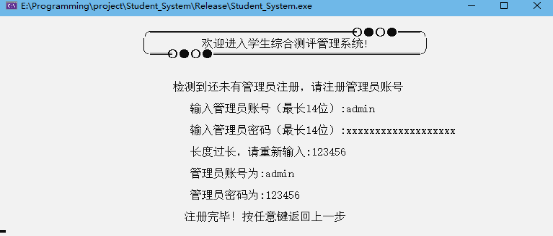

图1-1 管理员注册

 **2.以后进入时，显示主界面(登录/注册** **)**

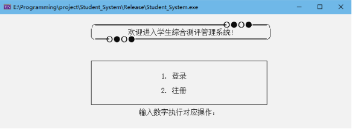

图1-2 主界面

**3.登录成功/失败**

图1-3-1 登陆成功")

图1-3-2 登陆失败")

**4.注册，若账号已存在，则提示重新输入账号**

### 管理员和用户主菜单显示

 **1** **.管理员主菜单显示**

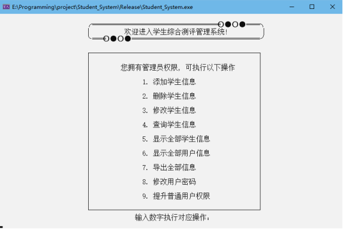

**2.普通用户主菜单显示**

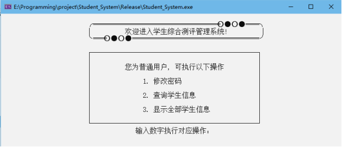

### 添加学生信息模块(管理员权限)

**1.添加学生信息，先输入唯一的学号，若已有该学生则提示重新输入**

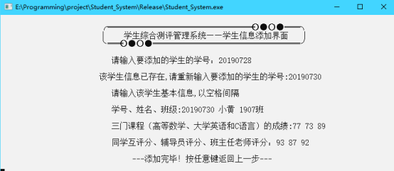

### 显示学生信息模块

 **1. 显示所有用户信息(管理员、用户均可使用**  **)**  **。按学号升序显示所有学生信息，并显示共有多少名学生，所有排名均为学生在自己班上的排名。(测试数据均使用添加模块添加** **)**

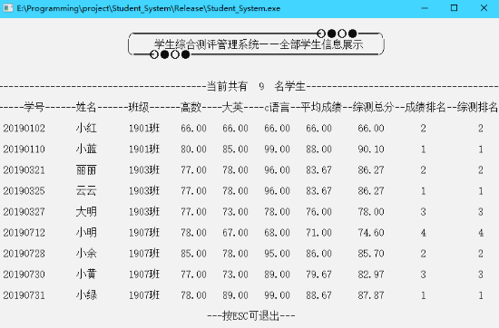

**2.显示所有用户信息（仅限管理员使用）**

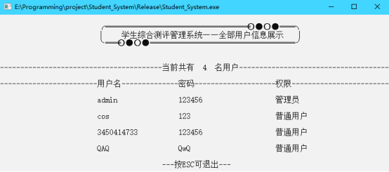

### 删除学生信息模块(管理员权限)

**1. 输入学号进行删除学生信息**

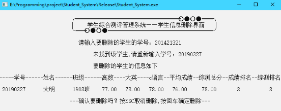

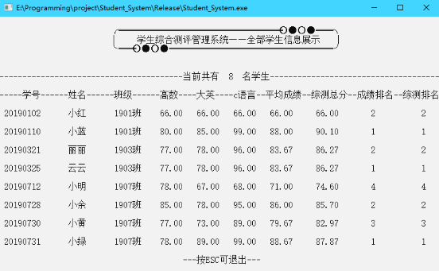

### 修改学生信息模块(管理员权限)

**1. 输入学号修改学生信息**

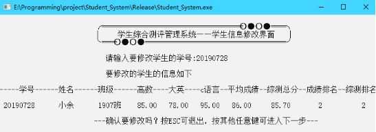

**2.显示修改一级菜单**

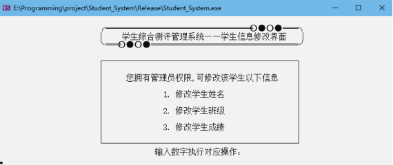

**3.修改成绩，则进入二级菜单**

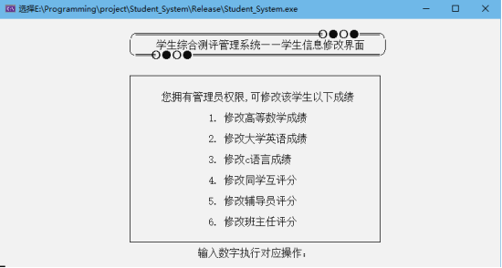

**4.修改后**

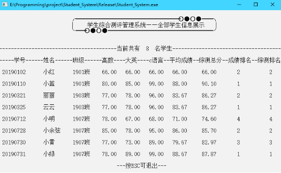

查询学生信息模块

**1.查询信息一级菜单**

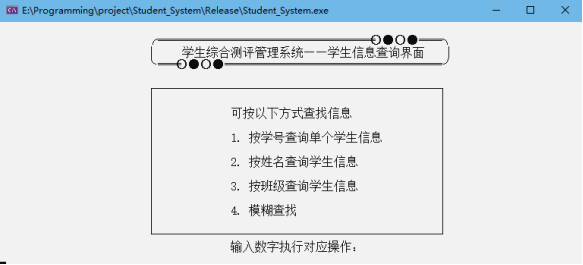

**2.查询信息——学号查询**


**3.查询信息——姓名查询**

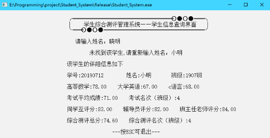

**4.查询信息——班级查询**

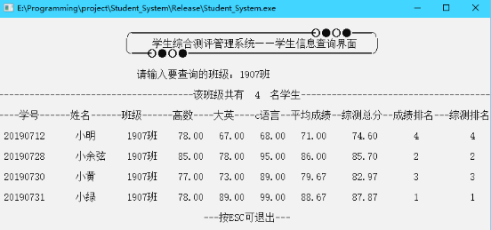

图6-4 班级查询

**5.查询信息——模糊查询**

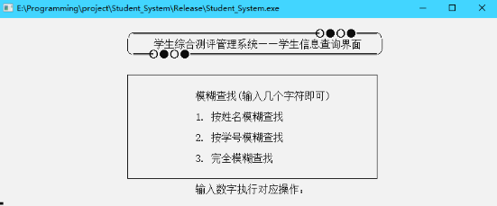

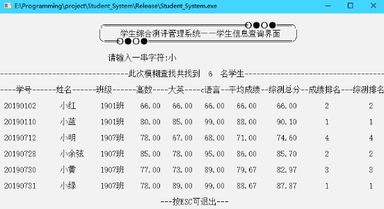

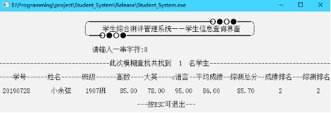

完全模糊查询(姓名/学号均可)


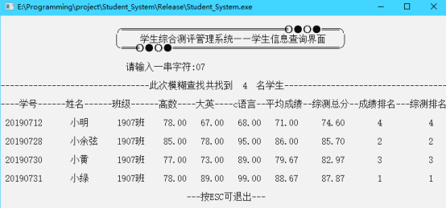

### 导出信息模块

**1.导出所有学生信息至****AllStudent.csv****文件中**


导出的学生csv文件信息

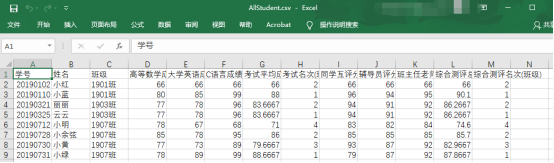

**2.导出所有用户信息至****AllUsers.csv****文件中**

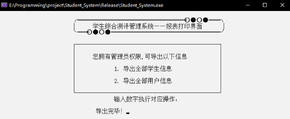

图7-2-1 导出全部学生信息

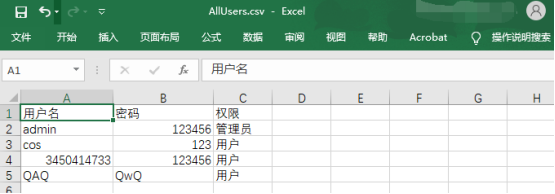

### 修改密码模块

 **1.管理员可修改所有用户的密码(包括自身** **)**

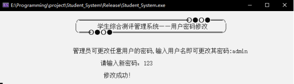

图8-1-1 管理员修改自身密码

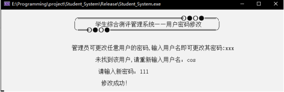

图8-1-2 管理员修改普通用户密码

**2.用户可修改自己的密码**

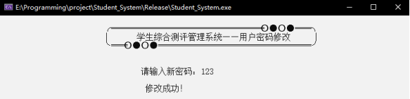

图8-2 普通用户修改自身密码

### 提升权限模块

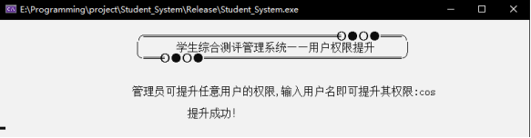

图9-1-1 管理员提升权限

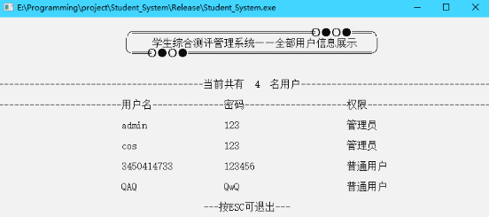

图9-1-2 管理员提升权限后用户信息


## 心得体会

由于本学期课设是学完c++后再进行的，因此可以用c++来进行这个课设，于是我便利用了很多c++中很方便的特性来简化代码逻辑，如STL容器存储对象、迭代器遍历修改、重载运算符规则方便排序等c++才有的功能，大大简化了代码逻辑。做这个课设从无到有基本结构和功能用了近三天时间，而优化排版、美观只用了不到一天。经过这次课设，我的代码能力得到了很大的提升，在不断地出bug、debug过程中也吸取了很多教训，而不足的地方也有许多，如程序本身还不是很面向对象，查找算法还有待加强、课程类还可以封装为一个类而不是单独的一个成绩等等，在代码中留下了许多可以改进的地方。这次课设之所以没有用链表存储，是因为我认为STL中的vector数组存储会更加方便，而为了掌握链表的知识，我也用c++写了一个模板类List，如有需要日后也可以用上，因此，我对指针的认识也有了很大的进步。
