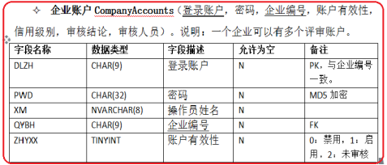

# 实验二 数据库设计 & 实验三 sql

本次实验就是根据场景画ER图......

一. 实验目的

    1、理解概念模型的意义，掌握根据给定业务需求描述建立相应概念模型的方法，并采用适当的图形化建模方法（如陈氏表示法的ER图或Martin表示法的IE鸦脚模型ER图等）和建模工具（如**Powerdesigner** 、Visio、RationalRose或ERWin等）；

2、掌握将ER模型转换为关系数据模型的基本方法；

    3、掌握运用关系规范化理论对模型进行优化处理的基本方法。

4、结合关系规范化理论对模型进行优化处理，使得每个关系模式达到至少3NF。

二. 实验要求

1）系统需求根据所给案例材料的相应内容描述进行整合，并对其中未说明的内容（如系统功能，实体的属性）根据个人理解补充完善，或添加必要的假设（如业务规则），作为后续模型设计的起点和模型验证的依据；

2）其他**不做强制要求**的内容：强、弱实体之分；父、子实体；标识、非标识联系之分；联系的最小基数。

三. 实验内容

从用户需求（详见所给材料）出发，按照数据库设计步骤，分别完成如下内容：

1、整理用户需求，并对材料中未明确说明的内容按自己的理解做出完善和假设，形成 **系统需求说明** （系统功能分解不作要求。重点在于 **数据需求** ！）；

2、概念设计：ER模型

a) 根据业务需求（包括自己假设的规则）提取必要的实体、属性和联系（包括联系的类型）；

b) 给出最终的全局 **ER图** （模型力求精简，消除不必要的冗余），并给出必要的说明。

3、逻辑设计：关系模型

a) 把ER模型转换成各个 **关系模式** ，并根据需要修改或添加列（如主键、外键等），为每个属性选择合适的数据类型，格式如下图所示；

b) 进行适当地 **规范化** （要求各关系模式至少满足3NF要求）；

c) 设计相关 **完整性约束** （主键、外键，其他不限）。

# 附件

## **易驾驾校案例研究**

**B.2易驾驾校案例研究**

易驾驾校1992年始建于格拉斯哥市。从那时起，学校规模稳定增长，现已有若干分校遍布于苏格兰的各主要城市。可是，驾校规模增长如此之快，以至于需要越来越多的行政人员来处理日益增长的文书工作。而且，各分校之间，甚至处在同一个城市的分校之间信息的交流和共享都非常匮乏。驾校的校长 Dave MacLeod认为，如果不改善这种状况就会有越来越多的错误发生，而且驾校的生命力也不强。他知道数据库能帮助解决部分问题，所以希望创建数据库系统以支持易驾驾校的运行。关于易驾驾校系统应如何操作，校长提供了下面的简单描述。

**B.2.1 数据需求**

每个分校配有一名校长(他一般也是高级教练)、几位高级教练、教练和若干行政人员。分校校长负责该分校每天的运营情况。驾校学员必须首先在学校登记，登记时要求填好申请表，记录个人情况。第一次上课前，学员必须参加由教练组织的面试，以获取该学员的特殊需求，并了解其是否已持有有效的临时驾驶执照。驾校学员在学习驾驶的过程中，可以自由指定教练或请求更换教练。面试以后，预约第一节课，学员可以要求上单人班或费用较少的多人班。单人班每次一小时，以到学校的时间开始计时，离开学校时结束计时。一节课在定长的时间内，有指定的教练和专车。所有课最早上午8点开始，最晚下午8点结束。一节课后，教练记录学员的学习情况和课堂上行驶的英里数。学校有很多车，主要用来教学，每个教练被分配到指定的车上。除用于教学外，教练个人可以免费使用这些车辆。驾校学员完成了全部课程后，就可以申请驾驶测试的日期。为了取得驾驶执照，驾校学员必须通过实践和理论两部分测试。教练的责任是确保驾校学员对测试进行充分的准备，但不负责测试学员,而且测试时不能待在车上，但是教练应该在测试中心接送驾校学员。如果驾校学员未能通过考试，教练必须记录未通过考试的原因。

**B.2.2查询事务（示例)**

校长提供了易驾驾校数据库系统中必须支持的一些典型查询的例子:

(a) 所有分校校长的名字和电话号码。

(b) 位于格拉斯哥市的所有分校的地址。

(c) 在格拉斯哥市的贝尔斯登分校工作的所有女教练的名字。

(d) 每个分校的员工总数。

(e) 每个城市中驾校学员(过去和现在)的总数。

(f) 下周某个教练预约的时间表。

(g) 某教练进行面试的情况。

(h) 格拉斯哥市贝尔斯登分校男女学员的总人数。

(i) 年龄超过55周岁且担任教练的员工的人数和名字。

(j) 没有发生故障的汽车的牌照号。

(k) 由格拉斯哥市贝尔斯登分校的教练所使用汽车的牌照号。

(l) 013年1月通过汽车驾驶测试的驾校学员名单。

(m) 参加三次以上驾驶测试仍没有通过的驾校学员的名单。

(n) 一小时课程驾驶的平均英里数。

(o) 每个分校的行政人员的数目。

实验报告要求的内容：

1) 查询所有分校校长的名字和电话号码；
2) 按城市、分校名称和教练性别，查询教练的基本信息；
3) 按城市汇总查询每个分校的员工人数；
4) 按年龄查询超过该年龄并且担任教练的员工信息；
5) 按年、月查询通过汽车驾驶测试的驾校学员名单及通过时间

**基于给定材料，补充说明如下：**

1）面试时由1个教练组织面试一批学员，面试结果可以在驾校内共享，并且面试教练不一定是将来的上课教练，并且允许调换上课教练。

2）理论考试与实践考试都要提前申请，并且单独申请，驾校根据学员提交的申请安排考试，不申请不能考试；考试不通过，再次申请。

提交申请时，可指定期望考试日期。考试结束后，记录考试结果。

材料中没有描述的内容和规则，我们可以分组讨论，整理完善。
