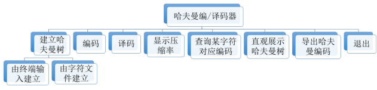
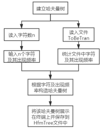
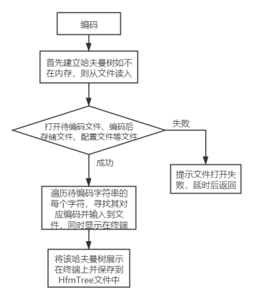
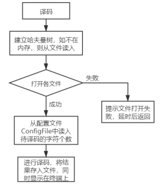
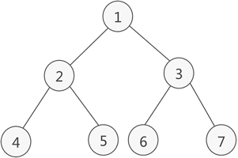
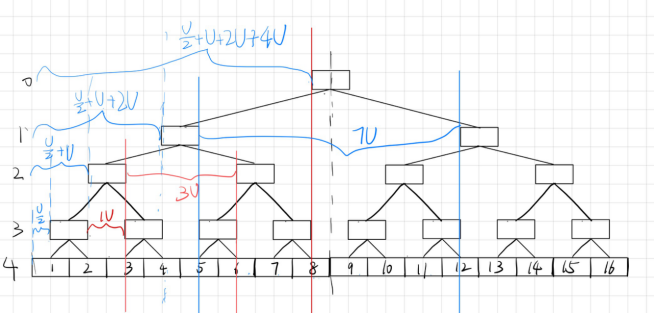
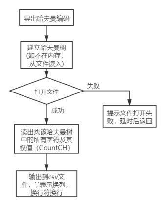
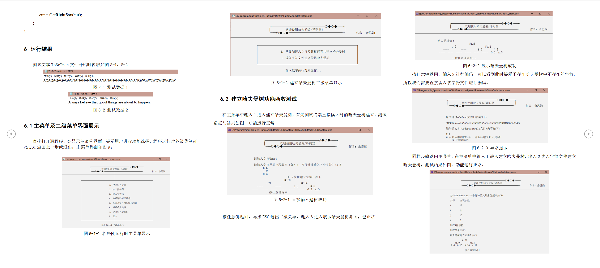
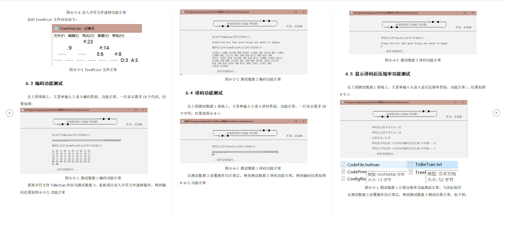
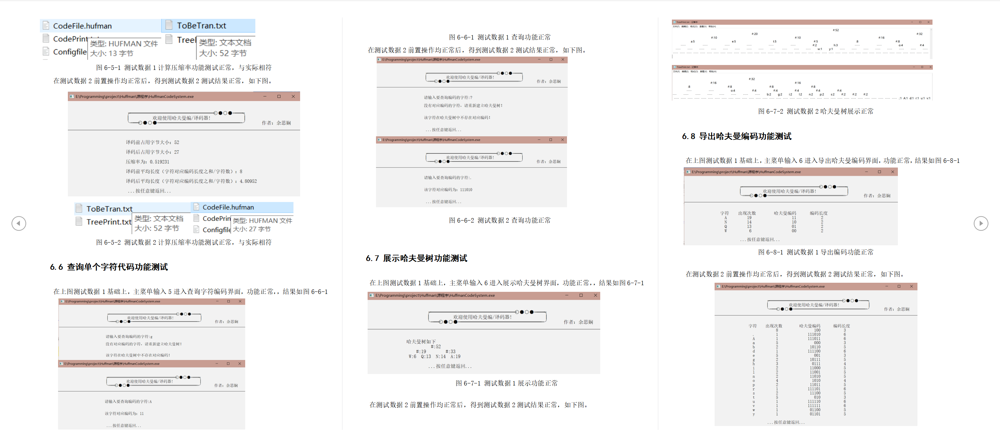

# **1 需求分析**

本系统中的数据来源于标准输入设备（如键盘）或者来自某文件，可以实现对字符文件进行哈夫曼编/译码，根据需要也显示编码信息、展示编/译码过程、导出对应编码等，即本编码器要具备如下功能：主菜单、建立哈夫曼树、哈夫曼编码、哈夫曼译码、显示译码后压缩率、查询某字符对应编码、展示哈夫曼树、导出哈夫曼编码，具体如下：

## 1.1 **建立哈夫曼树功能**

能实现两种建立哈夫曼树的途径，一是能从终端读入字符集大小 n,以及 n 个字符和 n 个权值，从而建立哈夫曼树；二是直接读取字符文件 ToBeTran，统计其中字符出现频率确定权值并显示在终端上，再建立哈夫曼树。建立的哈夫曼树以二进制形式存于文件 HfmTree。若文件打开/建立失败，进行提示。

## 1.2 **哈夫曼编码功能**

能实现利用已建好的哈夫曼树(如不在内存，则从文件 HfmTree 中读入)，对文件 ToBeTran 中的正文进行编码，编码后以文本形式显示在终端上，然后将编码结果以二进制形式存入文件 CodeFile 中、以文本形式（01 串）存入文件 CodePrint。若文件 ToBeTran 在哈夫曼树中没有对应字符，则提示需要重新建立哈夫曼树。

## 1.3 **哈夫曼译码功能**

能够将根据已建好的哈夫曼树(如不在内存，则从文件 HfmTree 中读入) 将文件 CodeFile 的内容译码后以文本形式显示在终端上，同时将文本形式的译码文件写入文件 TextFile 中。若文件 CodeFile 中在哈夫曼树中没有对应编码，则提示需要重新建立哈夫曼树。

## 1.4 **显示译码后压缩率**

能够显示文件 ToBeTran 在经过哈夫曼编码压缩后压缩成文件 CodeFile 的后压缩率与平均压缩长度。由于字符文件中每个字符（char 类型）在内存中都是以 ASCII 码进行存储，所以每个字符都占用了一个字节即 8bit，十分浪费空间，而利用哈夫曼树对每个字符进行 01 编码，利用位运算直接操纵每个比特，根据字符在文章中出现的频率调整 01 串长度，出现频率高的字符在哈夫曼树中的权重大，编码后 01 串短，从而使得最终计算出的平均编码长度会更小，压缩率更大。若文件打开/建立失败，进行提示。

## 1.5 **查询某字符对应编码功能**

能从终端读入一个字符，查询其在已建好的哈夫曼树(如不在内存，则从文件 HfmTree 中读入)中是否存在对应编码，若存在则显示其对应编码，若不存在则提示哈夫曼树中不存在对应编码。若文件打开/建立失败，进行提示。

## 1.6 **展示哈夫曼树**

能将已建好的哈夫曼树(如不在内存，则从文件 HfmTree 中读入)以直观的方式(树形式)显示在终端。即需要对已在内存中的或文件中的哈夫曼树进行层序遍历。若文件打开/建立失败，进行提示。

## 1.7 **导出哈夫曼编码**

能将已建好的哈夫曼树(如不在内存，则从文件 HfmTree 中读入)中叶子结点的字符及对应编码导出成 csv 格式的文件方便查阅，以文本形式将叶子结点中字符及其对应编码存入文件 CorresponCode 中，可以用 excel 表格打开。若文件打开/建立失败，进行提示。

## 1.8 **主菜单功能**

开始时需要有个主菜单进行选择，内容包含主菜单、建立哈夫曼树、哈夫曼编码、哈夫曼译码、显示译码后压缩率、查询某字符对应编码、展示哈夫曼树、导出哈夫曼编码、退出，其中建立哈夫曼树下设二级菜单选择以哪种途径建立哈夫曼树（终端输入/文件输入），过程中能实现按下 ESC 返回上一步，在主菜单中按下 ESC 退出程序。

# **2 概要设计**

## 2.1 **数据类型的定义**

### **定义访问哈夫曼结点指针（下标）**

将 int 别名为 Position，便于区分作用：typedef int Position;

### 定义常量

为了提高程序的可读性，方便后期进行修改，定义了一些常量，如表 1

表 1 各常量定义

| 常量名称     | 类型 | 值   | 意义                                               |
| ------------ | ---- | ---- | -------------------------------------------------- |
| Null         | int  | -1   | 相当于空指针，表示该节点不存在                     |
| MaxSize      | int  | 1000 | 待编码字符文件最大字符数，不得超出                 |
| MaxFrequence | int  | 200  | 各字符出现最大频率，不得超出                       |
| SideLen      | int  | 6    | 打印哈夫曼树时，一条边沿的长度为（SideLen 个空格） |
| MaxCodeNum   | int  | 10   | 编码后在终端上一行最多显示对应编码数量             |
| MaxTextNum   | int  | 50   | 译码后在终端上一行最多显示对应字符数量             |

为了 c++的打开文件参数，定义了一些字符串常量代替直接传文件名，方便后期进行修改，如表 2

表 2 各文件名及其作用

| 存储形式及作用                                             | 文件名            | 宏常量（string 型） |
| ---------------------------------------------------------- | ----------------- | ------------------- |
| 文本形式-哈夫曼树直观树形显示文件                          | TreePrint.txt     | TreePrintFile       |
| 二进制形式-存储哈夫曼树文件                                | HfmTree.hufman    | HfmTreeFile         |
| 文本形式-待编码的原文件                                    | ToBeTran.txt      | ToBeTranFile        |
| 二进制形式-编码后的压缩文件                                | CodeFile.txt      | CodeFile            |
| 二进制形式-配置文件,存储待翻译字符数以及译码实际占多少比特 | Configfile.hufman | ConfigFile          |
| 文本形式-由压缩文件解压缩而来的文本文件                    | TextFile.txt      | TextFile            |
| 文本形式-编码后压缩文件的直观展示文件(01 串)               | CodePrint.txt     | CodePrintFile       |
| 文本形式-存储哈夫曼树中字符及其对应编码，可用 excel 打开   | CorresponCode.csv | CorresponCodeFile   |

### **定义哈夫曼结点的元素类型**

    由于哈夫曼树是一次性构建好的，叶子结点的合并次数固定，即其大小固定且不需要频繁的插入删除修改，故可采用结构数组存储，通过下标起到类似指针的作用。运用STL中的map存储字符与其出现频率的对应关系。

表 3 哈夫曼单个结点 HTNode 类数据类型定义

| 类型     | 字段   | 作用                                                               |
| -------- | ------ | ------------------------------------------------------------------ |
| int      | weight | 该结点的权值出现频率越高权值越大                                   |
| char     | data   | 该结点实际代表的字符，值为'#' 表示该结点只有权值，无需要编码的字符 |
| int      | pos    | 该结点在完全二叉树中编号,1 表示根结点                              |
| Position | left   | 指向该结点的左孩子                                                 |
| Position | right  | 指向该结点的右孩子                                                 |
| Position | parent | 指向该结点的父结点                                                 |

HufTree 类内封装了存储哈夫曼树结点的指针、根结点下标以及哈夫曼树的大小，与一些哈夫曼树的基本操作和辅助功能操作函数。

表 4 哈夫曼树 HufTree 类数据类型定义

| 类型     | 字段 | 作用                           |
| -------- | ---- | ------------------------------ |
| HTNode\* | H    | 指向存储哈夫曼树结点的结构数组 |
| Position | root | 根结点下标                     |
| int      | size | 存储哈夫曼树的结构数组大小     |

### 部分全局变量定义

操作类对象定义：`Operate O`，用于执行各种功能模块

菜单类对象定义：`Menus menus`，用于显示各种菜单及提示

哈夫曼树 HufTree 类对象定义：`HufTree huf`，用于存储程序运行过程中建立的哈夫曼树，一直处于内存中。

各字符对应的哈弗曼编码定义：`map<char, string> HuffmanCode`;

各哈弗曼编码对应的字符定义：`map<string, char> DeHuffmanCode`;

## 2.2 **功能模块结构图**

根据需求分析，为了满足用户的功能需求，按照软件开发方法学中的模块划分原则，我将本系统主要划分为如下模块：建立哈夫曼树、编码、译码、显示压缩率、查询某字符哈夫曼编码、展示哈夫曼树、导出哈夫曼编码、退出，各模块之间的关系如图 1 所示。



图 1 各模块结构图

为了实现上述功能模块，分别在操作类、菜单类、哈夫曼树类上定义了多个函数，本系统定义的类、全局函数及其功能如下：

### （1） 初始化设置及菜单类 Menus

用于设置初始窗口大小、显示菜单界面、提示用户操作。全局函数有 void Init()，负责在开始时设置控制台窗口大小、背景色。菜单函数如下；void MainInterface()，负责进行功能选择及显示；void CreateHfmTree()，负责显示哈夫曼树二级菜单并进行选择。对应的菜单类函数如下表

表 5 菜单类函数及其功能

| 函数名 | 返回值 | 参数 | 作用                        |
| ------ | ------ | ---- | --------------------------- |
| Hint1  | void   | 无   | 提示欢迎使用哈夫曼编/译码器 |
| Hint2  | void   | 无   | 提示按任意键返回            |
| Menu1  | void   | 无   | 显示一级主菜单              |
| Menu2  | void   | 无   | 显示二级菜单建立哈夫曼树    |

### （2） 操作类 Operate

操作类中的函数分为两部分，一是哈夫曼树主菜单需要的功能函数（即在主菜单中选择后进入的函数），该部分函数起到引导作用，引导用户进行操作，同时调用一些必要的辅助功能的函数进行操作。二是辅助功能函数，这部分函数与哈夫曼树类内的结点一起，实现主菜单的各个功能。所有函数的函数名、参数、返回值与作用如表 6

表 6 操作类 Operate 各函数及其功能

| 函数名               | 返回值 | 参数 | 功能                                                                                                               |
| -------------------- | ------ | ---- | ------------------------------------------------------------------------------------------------------------------ |
| CreateHfmTreeByInput | void   | 无   | 从终端读入字符及其权值直接建立哈夫曼树,以二进制形式存入文件 HfmTree 中                                             |
| CreateHfmTreeByFile  | void   | 无   | 读取文件 ToBeTran 建立最优哈夫曼树                                                                                 |
| Encoding             | void   | 无   | 哈夫曼编码：对文件 ToBeTran 中的正文进行编码，编码后以二进制形式存入文件 CodeFile,以文本形式存入文件 CodePrintFile |
| Decoding             | void   | 无   | 哈夫曼译码将文件 CodeFile 的内容译码后以文本形式显示在终端上，译文存入文件 TextFile                                |
| PrintCompreRatio     | void   | 无   | 显示译码后压缩率与平均压缩长度                                                                                     |
| Search               | void   | 无   | 查询某字符对应编码功能                                                                                             |
| PrintHfmTree         | void   | 无   | 以树的形式直观展示哈夫曼树，并以文本形式存到文件 TreePrint 中                                                      |
| ExportHfmCode        | void   | 无   | 导出哈夫曼编码到 CorresponCode 文件中，并在终端上展示                                                              |

辅助功能

| 函数名                 | 返回值         | 参数             | 功能                                                            |
| ---------------------- | -------------- | ---------------- | --------------------------------------------------------------- |
| PrintCode              | void           | 无               | 展示文件 CodePrintFile，并输出经哈夫曼编码后的文本到终端上      |
| PrintHfmByTree         | void           | 无               | 展示文件 TreePrintFile，即以树形展示哈夫曼树                    |
| PrintToBeTranFile      | void           | 无               | 展示 ToBeTran 文件内容                                          |
| PrintCorresponCodeFile | void           | 无               | 展示已建好的哈夫曼树中各字符对应编码                            |
| PrintFrequence         | void           | map<char, int> m | 展示 m 中各字符及其出现次数                                     |
| StoreCorreCodeFile     | void           | 无               | 将已建好的哈夫曼树中各字符对应编码存入文件 CorresponCodeFile 中 |
| StoreHfmTree           | void           | 无               | 以二进制形式存储当前哈夫曼树到文件 HfmTree 中                   |
| ReadCHfile             | map<char, int> | 无               | 读入字符文件 ToBeTranFile 返回其中所有字符和出现频率            |
| ReadHufTreeFile        | void           | 无               | 从文件 HufTree 中读入哈夫曼树                                   |

### （3） 哈夫曼树类 HufTree、

该类的函数是进行哈夫曼树操作的核心函数，包括有哈夫曼树的建立、遍历、查询、获取哈夫曼结点信息等函数，所有函数的函数名、参数、返回值与作用如表 7

表 7 哈夫曼树 HufTree 类内各函数及其功能

| 函数名               | 返回值         | 参数                            | 作用                                                                          |
| -------------------- | -------------- | ------------------------------- | ----------------------------------------------------------------------------- |
| HufTree              | 无             | 无                              | 无参构造函数，进行初始化分配空间                                              |
| HufTree              | 无             | map<char, int> ch               | 有参构造函数，参数为字符及其频率                                              |
| ~HufTree             | 无             | 无                              | 析构函数，释放空间                                                            |
| IsLeaps              | bool           | Position rt                     | 判断当前节点是否为叶子节点                                                    |
| CountSize            | int            | map<char, int> ch               | 计算 ch 中字符种类个数                                                        |
| GetData              | char           | Position rt                     | 返回当前结点对应字符                                                          |
| SearchCode           | string         | char Data                       | 查询字符 Data 对应哈夫曼编码                                                  |
| GetLeftSon           | Position       | Position rt                     | 返回左儿子下标                                                                |
| GetRightSon          | Position       | Position rt                     | 返回右儿子下标                                                                |
| Huffman              | Position       | map<char, int> ch               | 根据 ch 构造哈夫曼树，返回根结点下标                                          |
| PrintChar            | void           | char ch, int num, fstream& fp   | 输出指定 num 个数的字符 ch 到文件 TreePrint 中                                |
| PrintSide            | void           | int num, fstream& fp            | 展示已建好的哈夫曼树中各字符对应编码                                          |
| CountCH              | map<char, int> | 无                              | 返回该哈夫曼树中的所有字符及其权值                                            |
| DrawHuffmanTree      | void           | Position rt                     | 以树形直观展示哈夫曼树存到文件 TreePrint 中去                                 |
| ComputingHuffmanCode | void           | Position root, string path = "" | 计算哈夫曼编码递归到叶子结点，参数 path 为根结点到这个结点的路径（左 0 右 1） |

# 3 运行环境

硬件环境：Intel Core i5-6300HQ 8G RAM

软件环境：操作系统 Windows 10 2002

# 4 开发工具和编程语言

开发环境：Visual Studio 2019

编程语言：C++语言

# 5 详细设计

## 5.1 建树

建树可直接从终端读入字符及权值，也可从字符文件中读入，其流程如图 2



图 2 建树流程图

难点在于如何根据字符及出现频率构造哈夫曼树这一步，首先计算出共统计了 kind 种字符,则需要进行一共需要 kind-1 次合并（注意特判 0 种和 1 种的情况），即需要申请 2\*kind+1 的空间给哈夫曼树。其次是将前 kind 个结点存入字符及其和权值，从第 1 个空结点开始（即第 kind+1 个结点），每次选两个在所有无父结点的结点中权值最小的结点合并后权值放到新的空结点内，将其设为两最小权值结点的父结点，同时将其左右孩子设为这两结点。合并完后，找出根结点下标并计算哈夫曼编码。构造完哈夫曼树后进行保存

核心代码如下:

```cpp
int kind = CountSize(ch);  // ch中共统计了多少种字符
size = 2 * kind - 1;	//一共需要kind + kind-1个结点
H = new HTNode[size];
int cnt = 0;
for (auto& i : ch) {  //前kind个节点 存字符及其和权值
H[cnt].data = i.first;
H[cnt].weight = i.second;
++cnt;
}
Position EmptyNode = cnt;  //最前边的空结点下标 0 1 2…
for (int k = 1; k <= kind - 1; ++k) {
//kind个叶子结点需要kind-1次合并
//每次合并选两个在所有无父结点的节点中中权值最小的结点
//合并后权值放到新的空结点内
int min1 = Null, min2 = Null;
//最小权值结点下标、次小权值结点下标
int minw1 = MaxFrequence + 1,minw2 = MaxFrequence + 1;
//最小权值1、次小权值2
for (int i = 0; i < size; ++i) {  //找两个最小无父结点的结点
if (H[i].parent != Null)	//有父节点的不用看
		continue;
		if (H[i].weight < minw1) {	//当前节点权值比最小值小
minw2 = minw1;
			min2 = min1;//将最小值赋给次小值
			minw1 = H[i].weight;
			min1 = i;//将当前结点权值赋给最小值
} else if (H[i].weight < minw2) {
//当前节点权值最小值大，比次小值小
		minw2 = H[i].weight;
		min2 = i;	//直接赋给次小值
	}
}
//合并
H[min1].parent = EmptyNode;
H[min2].parent = EmptyNode;
H[EmptyNode].left = min1;
H[EmptyNode].right = min2;
H[EmptyNode].weight = H[min1].weight + H[min2].weight;
H[EmptyNode].parent = Null;
EmptyNode++;
}
Position rt = 0;
while (H[rt].parent != -1) {
//有父节点的时候循环继续，找到根节点的时候循环退出
rt = H[rt].parent;
}
root = rt;
```

## 5.2 编码

编码时，利用已建好的哈夫曼树(如不在内存，则从文件 HfmTree 中读入)，对文件 ToBeTran 中的正文进行编码，然后将编码结果以二进制形式存入文件 CodeFile 中，其流程如图 3：



图 3 编码流程图

难点在于以二进制形式的压缩存储，由于文本文件 ToBeTran 中字符是由 ASCII 码的形式存储，一个字符占 1 个字节即 8 比特位，所以相当于长度为 8 的等长编码，浪费空间，而哈夫曼编码将这些字符压缩成 0、1 表示的编码，0/1 只占用 1 比特位，这样能大大降低文件的大小后可以充分利用空间，频率高的编码长度低，剩下不够的比特位用 0 来补，同时，为消除后补的 0 的影响，需要配置文件 ConfigFile 里存储所有字符个数，解压时读入该字符个数就可知道什么时候所有字符都已经解压。而压缩存储就需要用到位运算，定义一个无符号的 char 类型变量，对其进行位运算取每个比特来，满 8 位就将其存入文件

核心代码如下：

```cpp
unsigned char value = 0;//一定要注意是无符号的，不然有符号位的影响
int pos = 0;	//当前已操作了value几位， 满8位将value写入文件
int CHnum = 0; //存储已编码的字符个数
int Codelen = 0; //存储编码后的总代码长度
for (int i = 0; i < len; ++i) {//遍历待编码字符串的每个字符
		string Code = huf.SearchCode(Text[i]);
CHnum++;
		Codelen += Code.length()；
		for (int j = 0; j < Code.size(); ++j) {//核心！！
			//将字符转为二进制位，满8位就写入
			value <<= 1;		//每次先左移一位
			if (Code[j] == '1')	//为1 则将value的第8位置为1
				value |= 1;
			else			//为0 则将value的第8位置为0
				value |= 0;
			++pos;
			if (pos == 8) {//满8位写入文件  of2为文件CodeFile的文件指针
				of2.write((char*)&value, sizeof(value));
				pos = 0;
				value = 0;
			}
		}
}
if (pos) { //结束遍历后，pos=0说明刚好存完8位；pos!=0说明还有多余位 补齐
value <<= (8 - pos);
of2.write((char*)&value, sizeof(value));
}
//存储配置文件---存储待翻译字符数以及代码实际占多少bits
of3 << CHnum << ' ' << Codelen;	//of3为文件ConfigFile的文件指针
```

## 5.3 译码

译码时根据已建好的哈夫曼树(如不在内存，则从文件 HfmTree 中读入) 将二进制文件 CodeFile 的内容译码后，以文本形式显示在终端上，同时将文本形式的译码文件写入文件 TextFile 中。若文件 CodeFile 中在哈夫曼树中没有对应编码，则提示需要重新建立哈夫曼树。其流程如图 4：



图 4 译码流程图

译码过程，难点同样在二进制读取上，也通过位运算取单个比特，核心代码如下：

```cpp
int CHnum;
f2 >> CHnum;	 //读入待译码的字符个数 f2为配置文件的文件指针
//由压缩文件还原原文件
int pos = 7;	//当前要取value的第8-pos位
unsigned char value; 	//注意无符号！
f1.read((char*)&value, sizeof(value));		//f1为待译码文件CodeFile的文件指针
Position cur = huf.root;
while (CHnum && value != EOF) {
	//到叶子节点说明找到字符，放入解压文件
	if (huf.IsLeaps(cur)) {
//放入解压文件，并输出该字符到屏幕
		CHnum--;	//每解压一个字符，待译码字符个数-1
		cur = huf.root;
	}
	//如果不是叶子结点，0向左走，1向右走
	if (value & (1 << pos)) {		//取value的第8-pos位 为1往右走
		cur = huf.GetRightSon(cur);
	} else {		//为0往左走
		cur = huf.GetLeftSon(cur);
	}
	--pos;
	//当pos < 0时，说明此时已经解压完一个字节，开始解压下一个字节
	if (pos < 0) {
		pos = 7;
		f1.read((char*)&value, sizeof(value));
	}
//当CHnum <= 0时，字符已经全部解压完
	if (CHnum <= 0)
break;
}
```

## 5.4 显示压缩率

压缩率计算公式为译码前占用字节大小/译码后占用字节大小，平均长度计算公式为字符对应编码长度之和/字符数，由这两个参数可以清晰看出压缩是否成功。由于原文件是以文本形式存储，每个字符占 1 字节，故原文件的字符数量即为原文件占用字节大小，平均编码长度恒为 8，而压缩存储的文件是 8 个比特才为 1 字节，故不足 8 比特的需要补齐。核心代码如下：

```cpp
int CHsize = Text.length();//原文件的字符数量即为原文件占用字节大小
int CHnum, Codelen;
int TrueSize;		//压缩后文件的字节数
f2 >> CHnum >> Codelen;//读入译码后字符数(多少个字符)和代码长度（多少bits）
TrueSize = Codelen + (8-Codelen % 8);//先算占多少比特
int t = Codelen % 8;
if (t == 0) TrueSize = Codelen;
else TrueSize = Codelen + 8 - t;	//根据代码长度判断是否需要补齐
TrueSize /= 8;
cout << "\t\t\t译码前占用字节大小：" << CHsize << endl;
cout << "\n\t\t\t译码后占用字节大小：" << TrueSize << endl;
cout << "\n\t\t\t压缩率为：" << ratio << "\n" << endl;
double sum = 0;
for (auto& i : m) {  //m为字符及其权值
	char ch = i.first;
	sum += HuffmanCode[ch].length(); //总编码长度
}
ratio = sum / CHnum*1.0;
cout<<"\t\t\t译码前平均长度（字符对应编码长度之和/字符数）："<< 8 << endl;
cout<<"\t\t\t译码后平均长度（字符对应编码长度之和/字符数）：" << ratio << endl;
```

## 5.5 查询某字符对应编码

输入字符 `data` ,调用哈夫曼树类的操作函数 `SearchCode` 查询其对应编码并输出到终端上，`SearchCode` 中先调用 `ComputingHuffmanCode` 计算出哈夫曼编码。然后就可直接返回编码。 `ComputingHuffmanCode` 函数核心思想是递归到叶子结点，参数 `path` 为根结点到这个结点的路径（左 0 右 1）,到叶子结点的时候将 `HuffmanCode` 与 `DeHuffmanCode` 都存储上。

## 5.6 直观展示哈夫曼树

以满二叉树形式(如图 5，不存在的结点用"----")表示，尽量保证整齐好看。设 Unit 为 1 单元(1Sidelen)，先进行层序遍历，记录层数与每层的结点总数（不包括空结点），层序遍历的同时可以设置每个结点的 pos 值（从根结点 1 开始，若当前结点编号为 i，则左儿子编号为 2i，右儿子编号为 2i+1）。



图 5 满二叉树示意图

由图 6，易推测出设层数为 h,位于第 i 层的第一个结点开头缩进为 U/2+U+2U+4U……U\*2^(h-i-2),中间结点的缩进为 2^(h-1-i) – 1;



图 6 树形展示哈夫曼树树原理图

展示哈夫曼树的核心思想是先对哈夫曼树进行层序遍历，记录每层实际结点数与层数和层序遍历序列下标，并将每个结点的 pos 值设置好，再根据层序遍历序列，从上往下，自左往右进行该哈夫曼树的输出，计算当前位置该输出多少个字符。 核心代码如下：

```cpp
H[rt].pos = 1; q.push(rt);//q为Position类型的队列
while (!q.empty()){ //层序遍历，记录每个结点pos值与每层节点数以及高度
int len = q.size();
NodesNum.push_back(len);	//NodesNum为每层结点个数
++height;//层数+1
for (int i = 1; i <= len; ++i) {  //每一层的所有节点
	Position p = q.front();
	q.pop();
	LevelOrder[index++] = p;
	if (H[p].left != Null) {  //有左孩子
		int lr = H[p].left;
		q.push(lr);
		H[lr].pos = H[p].pos * 2;  //左孩子编号=父节点编号*2
	}
	if (H[p].right != Null) {  //有右孩子
		int rr = H[p].right;
		q.push(rr);
		H[rr].pos = H[p].pos * 2 + 1;//右孩子编号=父节点编号*2+1
	}
}
}
int cnt = 1;						//当前待输出结点编号
index = 0;
for (int h = 0; h < height; ++h) {	//第0层~最后一层
int tab = 0;	//每层开头的缩进
int Unit = SideLen / 2;		//单元大小
for (int i = 0; i < height - 1 - h; ++i) {
	tab += Unit;
	Unit *= 2;
}
PrintChar(' ', tab, f1);						  //开头缩进
for (int i = 0; i < NodesNum[h]; ++i, ++index) {
//遍历每一层的所有结点
Position p = LevelOrder[index];
//按层序遍历序列中的顺序来 自上而下 自左而右
	int interval = pow(2, height - 1 - h) - 1;
 //各层各结点间隔由层数决定
	if (cnt == H[p].pos) {	//当前节点恰为待输出节点 直接输出
		f1 << ' ' << H[p].data << ":" << H[p].weight << ' ';
		PrintSide(interval, f1);
		++cnt;
		if (i == NodesNum[h] - 1) {
//若当前节点该层最后一个有内容的结点，则看其后是否有空结点
//有则输出空结点及其间隔
			int p2 = pow(2,h+1)-1;
				for (; cnt <= p2; ++cnt) {
					f1 << " ---- ";
					PrintSide(interval, f1);
				}
		}
	} else {	//否则要输出空隙再输出结点
		for (; cnt < H[p].pos; ++cnt) {
			f1 << " ---- ";
			PrintSide(interval, f1);
		}
		f1 << ' ' << H[p].data << ":" << H[p].weight << ' ';
		PrintSide(interval, f1);
		cnt++;
	}
}
```

## 5.7 **导出哈夫曼编码**

将已建好的哈夫曼树(如不在内存，则从文件 HfmTree 中读入)中叶子结点的字符及对应编码导出成 csv 格式的文件方便查阅，将叶子结点中字符及其对应编码存入文件 CorresponCode.csv 中，可以用 excel 表格打开。若文件打开/建立失败，进行提示。流程如图



图 7 导出哈夫曼编码流程图

过程中调用 CountCH 函数计算哈夫曼树的所有字符及其对应权值，核心思想是非递归中序遍历（不输出结点）的同时，将叶子结点的字符和对应权值存下并返回，核心代码：

```cpp
Position cur = root;  	stack<Position> s; 
while (cur != Null || !s.empty()) {
while (cur != Null) {//一直向左并将沿途结点压入堆栈
	s.push(cur);
	cur = GetLeftSon(cur);
	}
	if (!s.empty()) {
	cur = s.top();
	s.pop();
	if (IsLeaps(cur)) {
		m[GetData(cur)] = H[cur].weight;
	}
	cur = GetRightSon(cur);
}
}
```

# 6 运行结果

建议看文档







# 7 总结

通过此次课程设计，我克服了各种难题，真正理解了哈夫曼编码的原理及其效率之高，虽然过程中遇到了许许多多的 bug，但都一一解决了。并且由于这个课设中需要直接操纵比特，更加加深了我对 c++语言中底层操作的理解，包括位运算的妙用、直接读写单个字节等，哈夫曼树的压缩效率也令我叹为观止。并且由于时间紧迫，不足的地方也有许多，如程序本身还不是很面向对象，查找算法还有待加强、一些操作还可以封装为一个类、一些基础数据结构还可以自己写个模板类封装等等，代码中存在许多可以改进的地方，以后有机会的话会继续改。
